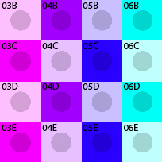

## godot-uv-tools

[Youtube video](https://www.youtube.com/watch?v=Igqqg7R-4sA)
 
**Simple Godot 4 plugin to that includes various tools to manipulate UVs.**
- *ProtoCube* node. Automatically performs a cube projection so that prototyping textures scale:

After scaling on the x axis, notice that the texture repeats and does not stretch:

---

**Godot Versions Tested**

- v4.2.1

---
## 🚀 Install & Use

1. Download this [repository](https://github.com/bikemurt/godot-uv-tools/), or download from the Godot Asset Library (not yet approved)
    - Import the addons folder into your project (if it already isn't present).
2. Activate the UV Tools addon under Project > Project Settings > Plugins. If an error dialog appears, restart the engine and try activating it again.
3. Add a "ProtoCube" node to your scene. Drop a texture onto the Albedo of the material override, and then scale the cube. You should see the cube projection update so that the texture tiles.

## ⚠️ Limitations

## 🏠 Links

- [Homepage](https://www.michaeljared.ca/)
- [Youtube](https://www.youtube.com/@michaeljburt)
- [Blender Market](https://blendermarket.com/creators/michaeljared)

## 🗒️ License

[MIT License](/LICENSE)
